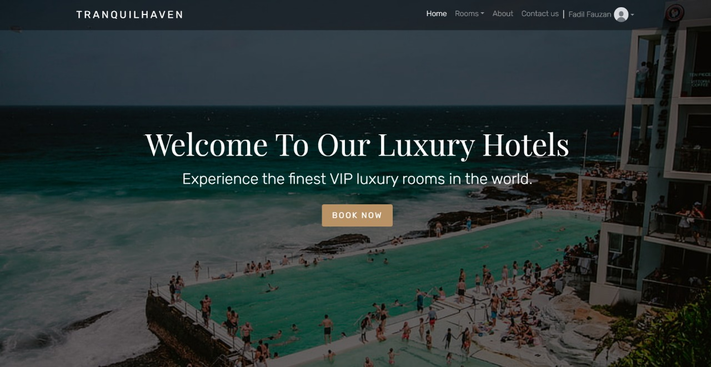
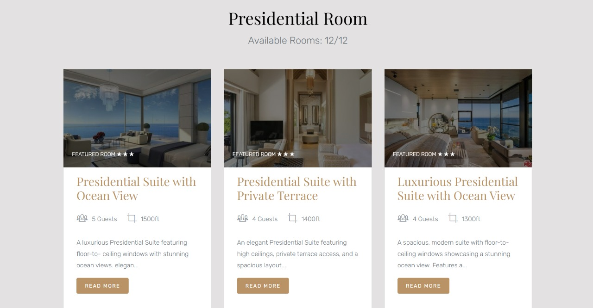
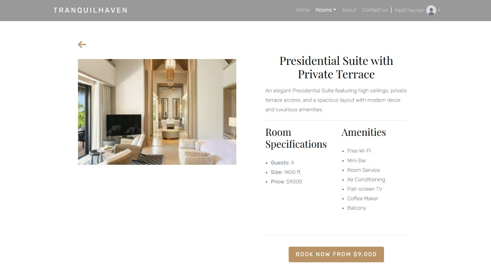
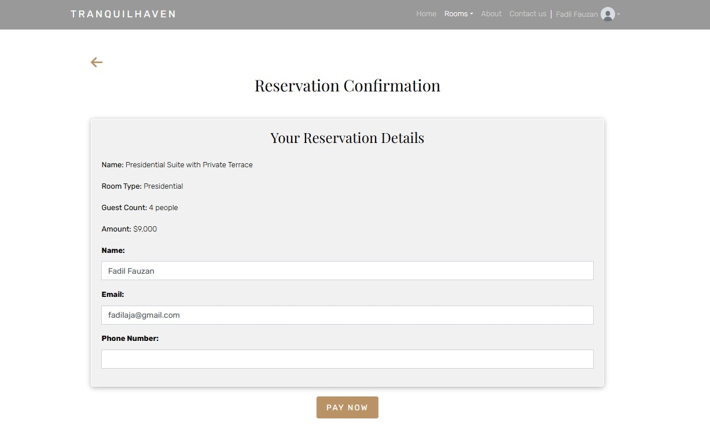
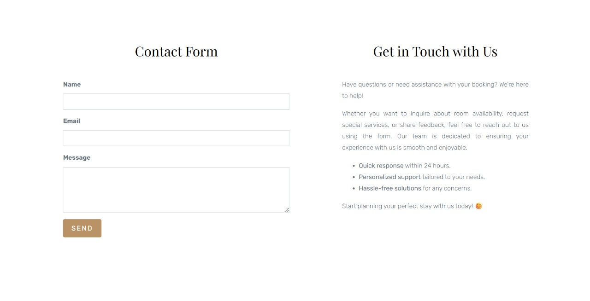

# **TranquilHaven Hotel**
### **Hotel Room Reservation System**


A responsive web application for hotel room reservations, built with **Laravel** and integrated with **Midtrans Payment Gateway**. This system provides a seamless experience for customers to book rooms and for administrators to manage room availability and bookings.

---

## **Features**

### **For Customers**
- **Room Browsing**: Explore rooms with images, capacity, size, and availability.
- **Category Filtering**: Filter rooms by specific categories.
- **Real-Time Availability**: Check room availability in real-time.
- **Secure Payments**: Make online payments securely through Midtrans.
- **Booking Receipt**: Get detailed payment receipts for every transaction.
- **Status Indicators**: Clearly see room statuses (*Booked* or *Available*).

### **For Administrators**
- **Room Management**: Add, edit, and manage room details, including categories and prices.
- **Dashboard Insights**: Monitor total rooms, booked rooms, and available rooms by category.
- **Automated Availability Updates**: Automatically update room statuses after successful bookings.
- **Transaction Records**: View transaction history with payment details.

---

## **Technologies Used**

### **Frontend**
- **HTML5**, **CSS3**, **SCSS**, **Bootstrap**: For a responsive and user-friendly interface.

### **Backend**
- **Laravel Framework**: To handle routing, database, and business logic.

### **Database**
- **MySQL**: To manage data for rooms, bookings, and transactions.

---

## Page Breakdown (with Visuals)

### Home Page



### Rooms Page



### Reservation Page


### Contact Page


---

## **Third-Party Services**

### **1. Midtrans API**
- **Purpose**: Provides secure and seamless payment transactions.
- **Features**:
  - Integration with various payment methods such as credit/debit cards, bank transfers, and e-wallets.
  - Supports 3D Secure for additional payment security.
  - Sandbox environment for testing before going live.
- **Setup**:
  1. Create an account at [Midtrans](https://midtrans.com) and obtain your **Server Key** and **Client Key**.
  2. Configure the credentials in the `.env` file:
     ```env
     MIDTRANS_SERVER_KEY=your_server_key
     MIDTRANS_CLIENT_KEY=your_client_key
     ```
- **Usage**: Handles all payment processing, including verifying payment success and status updates.

---

### **2. Mailtrap**
- **Purpose**: For testing and previewing emails before sending them to real users.
- **Features**:
  - Provides an inbox to capture test emails without sending them to users.
  - SMTP credentials for local email testing.
  - Useful for ensuring email formats and content are correct before going live.
- **Setup**:
  1. Sign up at [Mailtrap](https://mailtrap.io) and create an inbox.
  2. Configure the SMTP settings in your `.env` file:
     ```env
     MAIL_MAILER=smtp
     MAIL_HOST=sandbox.smtp.mailtrap.io
     MAIL_PORT=2525
     MAIL_USERNAME=your_mailtrap_username
     MAIL_PASSWORD=your_mailtrap_password
     MAIL_ENCRYPTION=null
     ```
- **Usage**: All email-related functionalities, like booking confirmations, are tested through Mailtrap during development.

---

### **3. Google OAuth API**
- **Purpose**: Enables users to log in using their Google account.
- **Features**:
  - Simplifies user authentication using Google credentials.
  - Secure and widely trusted method for login.
  - Reduces the need for users to remember another password.
- **Setup**:
  1. Create OAuth 2.0 credentials in the [Google Developer Console](https://console.developers.google.com/).
  2. Add the generated credentials to your `.env` file:
     ```env
     GOOGLE_CLIENT_ID=your_google_client_id
     GOOGLE_CLIENT_SECRET=your_google_client_secret
     GOOGLE_CLIENT_REDIRECT=http://127.0.0.1:8000/login/google/callback
     ```
- **Usage**: Google OAuth API handles the login flow for a smooth and secure experience.

---

## **Getting Started**

### **Prerequisites**
- PHP >= 8.1
- Composer
- Node.js & NPM
- MySQL

---

### **Setup & Installation**

```bash
git clone https://github.com/fadilfauzan/tranquilhaven-hotel.git
cd tranquilhaven-hotel
composer install
npm install && npm run dev
cp .env.example .env
php artisan key:generate
```
Update `.env` with DB credentials, then:

```bash
php artisan migrate --seed
php artisan serve
```

Visit: [http://127.0.0.1:8000](http://127.0.0.1:8000)

---

## File Structure (Simplified)

```
larassa/
├── public/
├── resources/
│   ├── views/
│   ├── css/ & js/
├── routes/web.php
├── .env
└── README.md
```

---
